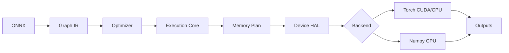

# AetherX Runtime Architecture

**[中文](ARCHITECTURE.md) | English**

## Core Direction

AEXRT is not a re-skin of DirectML's per-op device API. It is a portable
inference runtime:

1. **Graph IR** — frontend-agnostic; expresses model structure, constants,
   inputs and outputs.
2. **Graph Optimizer** — constant folding, dead-code elimination and op
   fusion before anything reaches a device.
3. **Portable Execution Core** — compiles a static execution plan, validates
   backend capabilities, plans buffer lifetimes.
4. **Capability Backends** — each backend declares op / dtype / feature /
   device capability; the runtime binds Torch, Numpy, the native D3D12 path
   (and future Vulkan/Metal) through this contract.
5. **Persistent Session** — constants upload once, execution plans replay,
   keeping first-token and batch latency low.

## Why This Beats a Single-Backend Library

- The model IR does not depend on any vendor API.
- A backend only implements `info()`, `prepare(graph)` and `run(inputs)` and
  declares its capabilities.
- The same model falls back to CPU automatically when no GPU is present.
- An ONNX subset imports directly, connecting to existing training/export
  ecosystems.
- DirectML / Vulkan / Metal can reuse the same optimizer and execution
  plans, swapping only the device executor.
- `backend="native_d3d12"` is AEXRT's own D3D12 entry point — it never calls
  DirectML.
- An explicit `device="d3d12"` never silently falls back to DirectML or CPU.

## Execution Flow



## Portable Execution Core

`src/aexrt/execution.py` defines the runtime middle layer:

- `DeviceInfo` — backend-agnostic device description.
- `BackendCapabilities` — structured sets: ops, dtypes, features, max_rank.
- `ExecutionPlan` — graph name, device, capabilities, node order, memory plan.
- `MemoryPlan` — constants, inputs, outputs, temporaries, value lifetimes.
- `BufferPlan` — per-value kind, shape, dtype, size estimate, allocation id.
- `AllocationPlan` — reusable device-memory blocks; currently only
  conservatively reuses temporaries with disjoint lifetimes.

This layer means DirectML, Vulkan or Metal never need to understand the
Python graph — they consume an already-validated execution and buffer plan.

## Device / Buffer HAL

`src/aexrt/device.py` defines AEXRT's own device layer:

- `RuntimeDeviceInfo` — device name, type, API, vendor, availability.
- `DeviceBuffer` — AEXRT buffer description: nbytes, shape, dtype, label,
  native handle.
- `HostDevice` — pure-Python host-memory implementation validating
  upload/download semantics.
- `NativeD3D12Device` — AEXRT native D3D12 entry; the target API is
  `aexrt_native_d3d12`, not DirectML.

## AEXRT Schedule Compiler

`src/aexrt/scheduler.py` is AEXRT's kernel-scheduling layer:

- **Lifetime-Colored Arena** — turns temporary lifetimes and allocation
  coloring into GPU arena offsets.
- **Shape-Specialized Kernel ABI** — stable signatures from
  graph/device/shape/dtype/op.
- **Elementwise Fusion Groups** — consecutive elementwise chains as the unit
  of future fused dispatches.
- **Tile-Wave Scheduler** — matmul tile-wave policy by vendor/dtype/shape.

This is one of the biggest philosophical splits from DirectML: AEXRT does
not hand the model to a generic operator API — it compiles its own schedule
and the native backend executes it.

## Latency Strategy

- Constants upload to the device at session init.
- `torch.inference_mode()` disables autograd.
- `FusedLinear` collapses the common linear-chain pattern into one node.
- CUDA Graph replay for fixed-shape low-latency paths.
- `backend="auto"` prefers CUDA, then the DirectML compatibility bridge,
  then Torch CPU / Numpy CPU. An explicit `device="d3d12"` selects only the
  AEXRT native D3D12 path.

## Backend Extension Protocol

```python
class Backend:
    def info(self) -> BackendInfo: ...
    def prepare(self, graph: Graph) -> None: ...
    def run(self, inputs: Dict[str, Any]) -> Dict[str, Any]: ...
```

`info().capabilities` example:

```python
{
    "ops": ["Add", "MatMul", "FusedLinear"],
    "dtypes": ["float16", "float32"],
    "features": ["persistent_constants", "static_execution_plan"],
    "device_type": "directml",
    "device_name": "GPU name",
}
```

## Verified Results

On a local `NVIDIA GeForce RTX 5060 Laptop GPU`:

- `benchmarks/benchmark_mlp.py` — Torch CUDA ~31x faster than Numpy CPU.
- `benchmarks/benchmark_low_latency.py` — CUDA Graph replay roughly halves
  small-graph latency.

Results vary with GPU, driver, shapes, thermals and background load.
