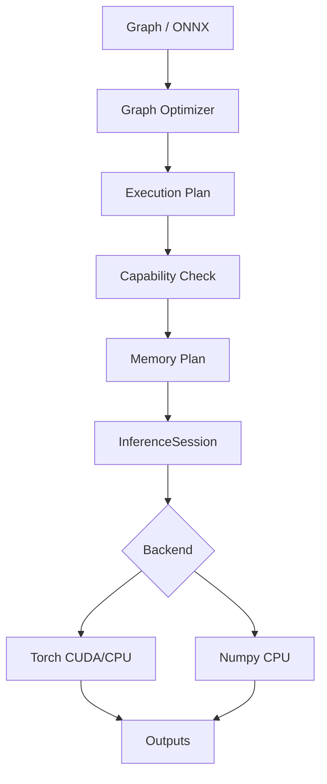

# AetherX Runtime 架构

## 核心方向

AEXRT 的路线不是复制 DirectML 的单层设备 API，也不是把 DirectML 包一层，而是做一个可移植推理运行时：

1. **Graph IR**：前端无关，表达模型结构、常量、输入输出。
2. **Graph Optimizer**：在进入设备前做常量折叠、冗余删除、算子融合。
3. **Portable Execution Core**：编译静态执行计划、校验后端能力、规划 buffer 生命周期。
4. **Capability Backend**：后端声明 op / dtype / feature / device 能力，运行时据此接入 Torch、Numpy、DirectML、Vulkan、Metal。
5. **Persistent Session**：常量一次上传，执行计划复用，减少首 token 与批处理延迟。

## 为什么比传统单后端推理库更通用

- 模型 IR 不依赖某个厂商 API。
- 后端只需要实现 `info()`、`prepare(graph)` 与 `run(inputs)`，并声明自身能力。
- 同一模型能在无 GPU 时自动退回 CPU。
- ONNX 子集可导入，方便连接现有训练/导出生态。
- DirectML / Vulkan / Metal 可以复用同一优化器和执行计划，只替换设备执行器。
- 当前 `backend="directml"` 是基于 `torch-directml` 的实验桥，目标是尽早验证跨厂商 GPU 路径。
- `backend="native_d3d12"` 是 AEXRT 自己的 D3D12 入口，不调用 DirectML；它面向未来的 `aexrt_native_d3d12` 原生扩展。
- 显式 `device="d3d12"` 不会静默 fallback 到 DirectML 或 CPU。

## 当前执行流



## Portable Execution Core

`src/aexrt/execution.py` 定义当前 runtime 中间层：

- `DeviceInfo`：后端无关设备描述。
- `BackendCapabilities`：结构化能力集合，包括 ops、dtypes、features、max_rank。
- `ExecutionPlan`：图名、设备、能力、节点序列、内存计划。
- `MemoryPlan`：constants、inputs、outputs、temporaries、value 生命周期。
- `BufferPlan`：每个值的 kind、shape、dtype、估算 nbytes、allocation id。
- `AllocationPlan`：可复用设备内存块，当前只保守复用生命周期不重叠的 temporary buffer。

这层的作用是让 DirectML、Vulkan、Metal 不需要重新理解 Python Graph，只需要接收已经校验过的执行计划和 buffer 计划。

## Device / Buffer HAL

`src/aexrt/device.py` 定义 AEXRT 自己的设备层：

- `RuntimeDeviceInfo`：设备名、类型、API、vendor、可用性。
- `DeviceBuffer`：AEXRT buffer 描述，包含 nbytes、shape、dtype、label、native handle。
- `HostDevice`：纯 Python host memory 实现，用来验证 upload/download 语义。
- `NativeD3D12Device`：AEXRT native D3D12 入口，目标 API 是 `aexrt_native_d3d12`，不是 DirectML。

这一层是为了让后续 D3D12/Vulkan/Metal 后端直接接入 AEXRT 自己的 buffer 与 command model。

## AEXRT Schedule Compiler

`src/aexrt/scheduler.py` 是 AEXRT 自己的 kernel 编译计划层：

- `Lifetime-Colored Arena`：把 temporary lifetime 和 allocation coloring 转成 GPU arena offsets。
- `Shape-Specialized Kernel ABI`：用 graph/device/shape/dtype/op 形成稳定 signature。
- `Elementwise Fusion Groups`：把连续 elementwise chain 作为未来 fused dispatch 的基本单位。
- `Tile-Wave Scheduler`：按 vendor、dtype、shape 选择 matmul tile-wave 策略。

这一层是 AEXRT 和 DirectML 最大的路线差异之一：AEXRT 不把模型直接交给一个通用 operator API，而是生成自己的调度计划，再由 native 后端执行。

## 延迟优化策略

- Session 初始化时把常量上传到设备。
- `torch.inference_mode()` 禁用 autograd。
- `FusedLinear` 把线性层常见链路合并为单个 runtime 节点。
- CUDA Graph replay 用于固定 shape 的低延迟路径。
- `backend="auto"` 默认优先选择 CUDA，其次 DirectML 兼容桥，然后 Torch CPU / Numpy CPU。
- 显式 `device="d3d12"` 只选择 AEXRT native D3D12。
- 未来 DirectML / Vulkan / Metal 后端应复用同样的 static execution plan 和 persistent buffer 思路。

## 后端扩展协议

后端需实现：

```python
class Backend:
    def info(self) -> BackendInfo: ...
    def prepare(self, graph: Graph) -> None: ...
    def run(self, inputs: Dict[str, Any]) -> Dict[str, Any]: ...
```

并在 `info().capabilities` 中声明：

```python
{
    "ops": ["Add", "MatMul", "FusedLinear"],
    "dtypes": ["float16", "float32"],
    "features": ["persistent_constants", "static_execution_plan"],
    "device_type": "directml",
    "device_name": "GPU name"
}
```

## 已验证结果

本机 `NVIDIA GeForce RTX 5060 Laptop GPU` 上运行：

- `benchmarks/benchmark_mlp.py`：Torch CUDA 约 31x 快于 Numpy CPU。
- `benchmarks/benchmark_low_latency.py`：CUDA Graph replay 将小图延迟约降低到一半。

结果会随 GPU、驱动、shape、温度和后台负载变化。
